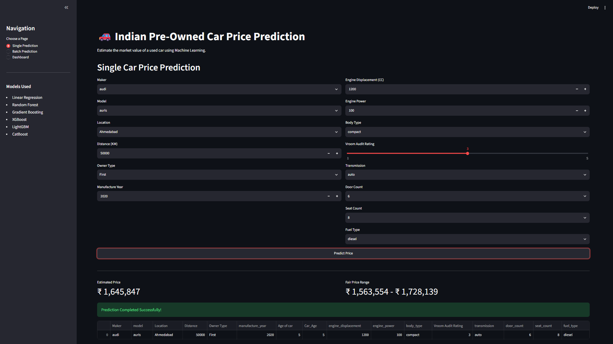
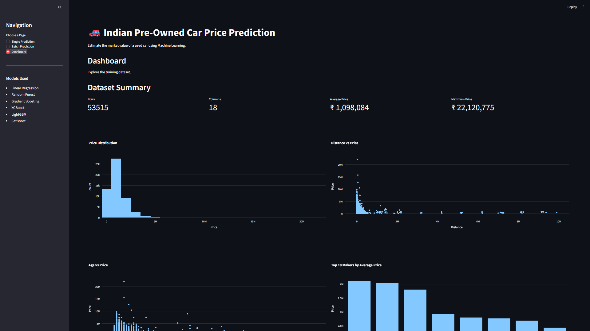
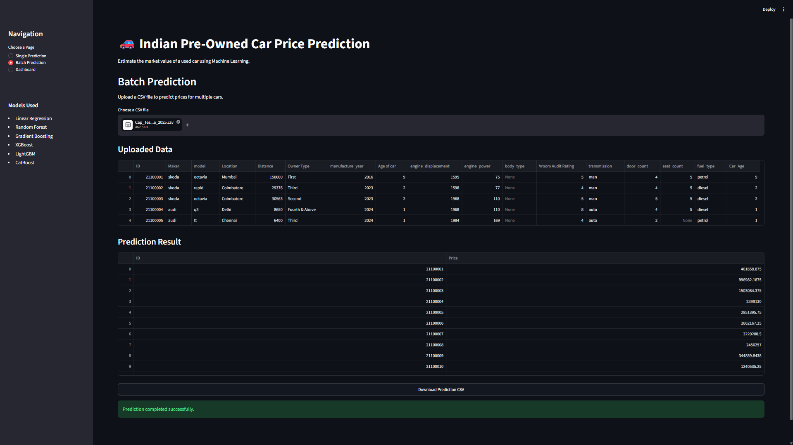

# Indian Pre-Owned Car Price Prediction


> Machine Learning Capstone Project for predicting used car prices in the Indian market using regression models and an interactive Streamlit application.

---

## Project Overview

**Indian Pre-Owned Car Price Prediction** is a machine learning project designed to estimate the selling price of used cars in India based on vehicle, location, ownership, engine, and usage-related features.

The project covers the complete machine learning lifecycle, including exploratory data analysis, missing value handling, feature engineering, preprocessing pipelines, model training, hyperparameter tuning, model evaluation, model serialization, and deployment through a Streamlit web application.

This project demonstrates practical machine learning skills across data analysis, regression modeling, evaluation, and user-facing deployment.

---

## Features

- Complete exploratory data analysis
- Missing value handling
- Feature engineering
- Data preprocessing using `Pipeline` and `ColumnTransformer`
- Regression model training
- Hyperparameter tuning using `RandomizedSearchCV`
- Cross-validation
- Model comparison using RMSE, MAE, and R2 Score
- Feature importance visualization
- Model serialization using Joblib
- Streamlit web application
- Single car price prediction
- Batch CSV prediction
- Interactive dashboard
- Download prediction CSV

---

## Technologies Used

| Category | Tools |
|---|---|
| Programming Language | Python |
| Data Processing | Pandas, NumPy |
| Visualization | Matplotlib, Seaborn, Plotly |
| Machine Learning | Scikit-learn, XGBoost, LightGBM, CatBoost |
| Model Saving | Joblib |
| Web Application | Streamlit |
| Notebook Environment | Jupyter Notebook |

---

## Machine Learning Workflow

```text
Raw CSV Datasets
    |
    +-- Training Data
    +-- Test Data
    +-- Sample Submission
    |
    v
Data Understanding
    |
    +-- Shape and schema inspection
    +-- Data type validation
    +-- Missing value analysis
    +-- Target variable review
    |
    v
Exploratory Data Analysis
    |
    +-- Price distribution analysis
    +-- Maker and model trends
    +-- Location-based pricing patterns
    +-- Distance and age relationship analysis
    +-- Outlier and correlation analysis
    |
    v
Data Preparation
    |
    +-- Column name cleaning
    +-- Missing value handling
    +-- Type conversion
    +-- Train-test split
    |
    v
Feature Engineering
    |
    +-- Car age features
    +-- Engine specification features
    +-- Ownership and usage features
    +-- Categorical feature preparation
    |
    v
Preprocessing Pipeline
    |
    +-- Numerical imputation
    +-- Categorical imputation
    +-- One-hot encoding
    +-- Feature scaling
    +-- ColumnTransformer integration
    |
    v
Model Development
    |
    +-- Linear Regression
    +-- Random Forest Regressor
    +-- Gradient Boosting Regressor
    +-- XGBoost Regressor
    +-- LightGBM Regressor
    +-- CatBoost Regressor
    |
    v
Model Validation and Selection
    |
    +-- Cross-validation
    +-- RMSE evaluation
    +-- MAE evaluation
    +-- R2 Score comparison
    +-- Feature importance analysis
    |
    v
Hyperparameter Tuning
    |
    +-- RandomizedSearchCV
    +-- Best estimator selection
    +-- Final pipeline selection
    |
    +-----------------------------+
    |                             |
    v                             v
Model Serialization          Prediction Generation
    |                             |
    +-- Joblib model saving       +-- Test set prediction
    +-- Final model artifact      +-- Submission CSV export
    |
    v
Streamlit Deployment
    |
    +-- Single car prediction
    +-- Batch CSV prediction
    +-- Interactive dashboard
    +-- Prediction CSV download
```

### Workflow Summary

| Stage | Key Actions | Output |
|---|---|---|
| Data Ingestion | Load training, test, and sample submission CSV files | Structured Pandas DataFrames |
| Data Understanding | Inspect shape, data types, missing values, duplicates, and target distribution | Initial data quality report |
| Exploratory Data Analysis | Analyze price trends by maker, model, fuel type, location, distance, and age | Visual insights and modeling assumptions |
| Data Cleaning | Handle missing values, inconsistent column names, and noisy records | Cleaner training and inference data |
| Feature Engineering | Create age-related features and prepare vehicle specification variables | Improved feature set |
| Preprocessing Pipeline | Apply imputation, encoding, scaling, and column-wise transformations | Reusable Scikit-learn preprocessing pipeline |
| Model Training | Train multiple regression algorithms on prepared features | Candidate models |
| Cross Validation | Validate model performance across folds | More reliable performance estimate |
| Hyperparameter Tuning | Use `RandomizedSearchCV` to search stronger model settings | Tuned model configuration |
| Model Evaluation | Compare RMSE, MAE, and R2 Score across models | Final model selection |
| Feature Importance | Analyze influential features from tree-based models | Model interpretability insights |
| Model Serialization | Save the final trained model using Joblib | `models/best_model.pkl` |
| Deployment | Build Streamlit app for single, batch, and dashboard views | Interactive ML web application |

---

## Models Implemented

| Model | Type |
|---|---|
| Linear Regression | Baseline regression model |
| Random Forest Regressor | Ensemble bagging model |
| Gradient Boosting Regressor | Boosting-based regression model |
| XGBoost Regressor | Optimized gradient boosting model |
| LightGBM Regressor | Fast gradient boosting framework |
| CatBoost Regressor | Gradient boosting model for categorical features |

---

## Evaluation Metrics

| Metric | Description |
|---|---|
| RMSE | Measures the square root of average squared prediction error. Lower is better. |
| MAE | Measures the average absolute difference between actual and predicted prices. Lower is better. |
| R2 Score | Measures how well the model explains variance in car prices. Higher is better. |

---

## Dataset Information

The project uses car listing datasets provided as CSV files.

| File | Purpose |
|---|---|
| `Cap_Training_Data_2025.csv` | Training dataset used for EDA, preprocessing, and model training |
| `Cap_Test_Data_2025.csv` | Test dataset used for final prediction generation |
| `Cap_Sample_Submission_2025.csv` | Sample submission format |

### Example Feature Groups

- Car maker and model
- Location
- Distance driven
- Owner type
- Manufacturing year
- Engine displacement
- Engine power
- Body type
- Transmission type
- Fuel type
- Door count
- Seat count
- Audit rating

---

## Preprocessing Steps

- Removed or handled missing values
- Cleaned inconsistent column names
- Processed numerical and categorical columns separately
- Applied imputation where required
- Encoded categorical variables
- Scaled numerical features where applicable
- Built reusable preprocessing workflow using `Pipeline` and `ColumnTransformer`
- Generated derived age-related features for model prediction

---

## Project Structure

```text
Indian-Car-Price-Prediction/
|-- app/
|   `-- app.py
|-- data/
|   |-- Cap_Sample_Submission_2025.csv
|   |-- Cap_Test_Data_2025.csv
|   `-- Cap_Training_Data_2025.csv
|-- images/
|   |-- batch_prediction.png
|   |-- dashboard.png
|   `-- home.png
|-- models/
|   |-- best_model.pkl
|   |-- feature_names.pkl
|   `-- preprocessor.pkl
|-- notebooks/
|   |-- Car_Price_Prediction.ipynb
|   `-- catboost_info/
|-- outputs/
|   `-- submission.csv
|-- .gitignore
|-- requirement.txt
|-- requirements.txt
`-- README.md
```

---

## Installation

### 1. Clone the Repository

```bash
git clone https://github.com/Somyaranjan-Jena/Indian-Pre-Owned-Car-Price-Prediction.git
cd Indian-Pre-Owned-Car-Price-Prediction
```

### 2. Create a Virtual Environment

```bash
python -m venv .venv
```

### 3. Activate the Virtual Environment

Windows:

```bash
.venv\Scripts\activate
```

macOS/Linux:

```bash
source .venv/bin/activate
```

### 4. Install Requirements

```bash
pip install -r requirements.txt
```

---

## Required Libraries

```text
pandas
numpy
scikit-learn
xgboost
lightgbm
catboost
streamlit
plotly
joblib
matplotlib
seaborn
```

---

## How to Run the Notebook

Start Jupyter Notebook:

```bash
jupyter notebook
```

Open the notebook:

```text
notebooks/Car_Price_Prediction.ipynb
```

Run all cells to perform EDA, preprocessing, model training, evaluation, and model saving.

---

## How to Run the Streamlit App

Launch the Streamlit application:

```bash
streamlit run app/app.py
```

The application includes:

- Single car price prediction
- Batch CSV prediction
- Interactive dashboard
- Downloadable prediction output

---

## Screenshots

### Home Page



### Dashboard



### Batch Prediction



---

## Model Performance

The models were evaluated using RMSE, MAE, and R2 Score.

| Model | RMSE | MAE | R2 Score |
|---|---:|---:|---:|
| Linear Regression | 1.1033 | 0.9272 | 0.5602 |
| Random Forest Regressor | 1.1207 | 0.9133 | 0.5462 |
| Gradient Boosting Regressor | 1.0612 | 0.9183 | 0.5931 |
| XGBoost Regressor | 1.1671 | 0.9960 | 0.5079 |
| LightGBM Regressor | 1.1895 | 0.9764 | 0.4888 |
| CatBoost Regressor | 1.1271 | 0.9457 | 0.5410 |

<details>
<summary>Notes on Performance</summary>

Based on R2 Score and RMSE, the Gradient Boosting Regressor achieved the strongest performance among the evaluated models.

</details>

---

## Future Improvements

- Add live deployment on Streamlit Community Cloud
- Improve UI styling and user experience
- Add model explainability using SHAP
- Add automated data validation for uploaded CSV files
- Store predictions and user inputs in a database
- Add more advanced feature engineering
- Build an API endpoint for predictions
- Add CI/CD workflow for testing and deployment

---

## Acknowledgements

- Python open-source ecosystem
- Scikit-learn documentation
- XGBoost, LightGBM, and CatBoost communities
- Streamlit for simple and fast ML app deployment
- Dataset providers and project mentors

---

## Author

| Name | GitHub |
|---|---|
| Somyaranjan Jena | [Somyaranjan-Jena](https://github.com/Somyaranjan-Jena) |

---

## License

This project is licensed under the **MIT License**.

You are free to use, modify, and distribute this project with proper attribution.
